---

# NHS A&E Attendances and Emergency Admissions
## Trend Analysis | Financial Year 2025/26

---

## Project Overview
This project examined NHS England A&E attendance and emergency admission
data across the full 2025/26 financial year covering April 2025 to
March 2026. The analysis covers all NHS trusts and providers submitting
monthly A&E returns to NHS England, producing 15 analytical outputs
that track performance trends, identify providers with the greatest
performance challenges, quantify the impact of winter pressure and
assess performance consistency across the system.

---

## Objectives
- Quantify monthly A&E attendance volumes and identify seasonal patterns.
- Track 4-hour performance against the NHS England standard across the year.
- Measure the scale and trend of patients waiting 12 or more hours before admission.
- Identify highest volume providers and those with the greatest performance challenges.
- Identify best performing providers and assess performance consistency across the year.
- Analyse emergency admission trends across the financial year.
- Compare regional attendance volumes and breach rates across NHS England.
- Assess performance variation across NHS England regions.
- Analyse month on month changes in attendance volumes and breach rates.
- Assess the impact of winter pressure from December 2025 to February 2026.
- Present findings in a summary performance heatmap across the top 20 providers.
- Execute SQL analytical queries against a PostgreSQL database.
- Present key findings in an interactive Power BI dashboard.

---

## Data Source
| | |
|---|---|
| **Publisher** | NHS England |
| **Dataset** | A&E Attendances and Emergency Admissions 2025/26 |
| **Coverage** | Approximately 200 NHS trusts and providers per month |
| **Frequency** | Monthly |
| **Access** | [NHS England Statistics](https://www.england.nhs.uk/statistics/statistical-work-areas/ae-waiting-times-and-activity/) |

---

## Tools and Libraries
| Tool | Purpose |
|---|---|
| Python 3.12 | Core programming language |
| pandas | Data loading, cleaning and transformation |
| matplotlib | Chart production and formatting |
| seaborn | Chart styling and colour palettes |
| PostgreSQL 16 | Database storage and SQL analysis |
| SQLAlchemy | Python to PostgreSQL connection |
| psycopg2 | PostgreSQL database adapter |
| Power BI Desktop | Interactive dashboard |
| Jupyter Notebook | Interactive analysis environment |

---

## Key Findings

### National Performance
26,965,026 A&E attendances were recorded across England in 2025/26.
The overall 4-hour breach rate was 39.4%, nearly double the NHS target
ceiling of 24%. The gap to target was 15.4 percentage points. The NHS
missed the 24% target in all 12 reporting periods. A breach rate
consistently operating at nearly double the target ceiling across every
single month of the financial year indicates a structural performance
problem, not a seasonal or marginal shortfall.

### Attendance Volumes
March 2026 was the busiest month with 2,351,317 attendances. February
2026 was the quietest month with 2,043,572 attendances. Monthly volumes
were broadly stable ranging from 2.04 million to 2.35 million throughout
the year, with no evidence of a sustained demand spike driving the
system-wide performance challenge.

### 4-Hour Breach Rate
January 2026 recorded the highest breach rate at 44.8%. March 2026
recorded the lowest at 37.9%. The breach rate exceeded 40% in 10 out
of 12 reporting periods. March 2026 was simultaneously the busiest month
by attendances and the best month by breach rate. Higher demand in March
did not produce worse performance, a finding that warrants closer
investigation at trust level to understand what operational conditions
drove the improvement.

### 12 Hour or Longer Waits
570,931 patients waited 12 or more hours before being admitted to
hospital across the full year. January 2026 recorded the highest monthly
volume at 71,517 patients, nearly double the July 2025 low of 35,467.
The concentration of ultra-long waits in winter months, combined with
lower overall attendance volumes in that period, points to bed capacity
and patient flow constraints rather than demand as the primary driver.

### Emergency Admissions
6,451,848 emergency admissions were recorded across 2025/26, an
emergency admission rate of 23.9%, approximately 1 in 4 attendances
resulted in an emergency admission. July 2025 was the highest month
at 559,392 admissions and February 2026 the lowest at 493,015. Monthly
volumes were broadly stable throughout the year with no significant
seasonal variation in admission rates.

### Month on Month Performance
The year followed a clear seasonal pattern. Performance improved in
spring from May through July, deteriorated continuously through autumn
and into winter from August through January, then recovered sharply in
February and March. January 2026 recorded the worst single month
deterioration at 2.2 percentage points. Attendance in January was
nearly flat at 0.2% below December, indicating that January's
deterioration was driven by capacity and staffing constraints rather
than a demand spike. March 2026 recorded the largest single month
improvement at 4.7 percentage points despite also recording the largest
attendance surge of the year at 15.1%, reinforcing that demand volume
alone does not determine performance outcomes.

### Winter Pressure
Winter from December 2025 to February 2026 averaged 2,173,285
attendances per month, lower than the rest of the year at 2,271,686.
Despite seeing fewer patients per month, winter produced a breach rate
2.7 percentage points higher at 41.5% versus 38.8% and generated 1.35
times more 12 hour or longer waits at an average of 58,980 per month
compared to 43,777 for the rest of the year. Winter's performance
challenge is a capacity and flow problem, not an attendance volume
problem. The system sees fewer patients in winter but manages them
less effectively, a finding that has direct implications for winter
planning and resource allocation.

### Provider Performance — Worst
Mid Cheshire Hospitals NHS Foundation Trust recorded the highest breach
rate at 56.4%. Every trust in the worst 10 recorded a mean breach rate
above 52%, more than double the 24% NHS target ceiling. These figures
represent sustained year-round performance challenges that persist
across these organisations throughout the year rather than isolated
seasonal pressures. University Hospitals Plymouth NHS Trust appeared
in both the worst performers list at 55.0% and the most variable
performers list with a standard deviation of 6.8, a combination that
is consistent with performance that lacks both a reliable baseline
and a stable improvement trajectory.

### Provider Performance — Best
Sheffield Children's NHS Foundation Trust recorded the lowest breach
rate at 7.6%. The top 5 best performing providers were all children's
hospitals or specialist trusts. Specialist trusts treating a narrower
patient population with more predictable care pathways consistently
outperformed large general acute trusts against the 4-hour standard.
Only 5 of the best 10 providers actually met the 24% NHS target,
reinforcing that the performance challenge extends across the system
and is not limited to the worst performers.

### Provider Performance — Consistency
Princess Alexandra Hospital NHS Trust recorded the highest standard
deviation of monthly breach rates at 7.5, indicating performance that
swings by approximately 7.5 percentage points around its mean from
month to month. Performance variability of this scale is consistent
with a trust that lacks a stable improvement trajectory. Chesterfield
Royal Hospital NHS Foundation Trust appeared in both the worst
performers list at 53.1% and the most variable list at 7.3. The
combination of persistently elevated breach rates and high monthly
variability represents the most challenging performance profile in
the dataset. Mid and South Essex NHS Foundation Trust showed the most
dramatic trajectory, improving to 26.3% by July 2025 before
deteriorating to 43.5% by January 2026, an early improvement that
was not sustained across the year.

### Regional Performance
NHS England Midlands was the busiest region with 4.90 million
attendances. NHS England South West was the quietest with 2.38 million.
NHS England North West recorded the highest breach rate at 42.6% and
NHS England South East the lowest at 36.9%. The spread between the
worst and best regions was just 5.7 percentage points, indicating that
the A&E performance challenge is broadly uniform across England rather
than concentrated in specific geographies. There is no meaningful
relationship between attendance volume and breach rate at regional
level. London handled 4.84 million attendances with a 37.5% breach
rate while the North West handled fewer at 3.79 million yet recorded
the worst breach rate at 42.6%, demonstrating that demand volume alone
does not explain regional performance variation.

### Summary Heatmap
Among the top 20 providers by Type 1 attendance volume, Lewisham and
Greenwich NHS Trust recorded the highest mean breach rate at 49.4%,
never falling below 45% in any month of the year. Calderdale and
Huddersfield NHS Foundation Trust recorded the lowest mean at 16.6%,
the only trust in this group consistently operating below the 24%
target ceiling throughout the year. The 32.8 percentage point gap
between the best and worst performers in this high volume group
represents one of the most striking performance differentials in the
dataset and demonstrates that trust level operational conditions drive
outcomes alongside system-wide pressures.

---

## Analyses
| Analysis | Description |
|---|---|
| 1 | Monthly attendance volume: total A&E attendances by month |
| 2 | Monthly 4-hour breach rate trend compared to NHS target |
| 3 | Monthly 12 hour or longer wait trend |
| 4 | Top 10 providers by total Type 1 attendance volume |
| 5 | Worst 10 providers by 4-hour breach rate |
| 6 | Monthly emergency admissions trend |
| 7 | Regional attendance breakdown by NHS England region |
| 8 | Winter pressure: December 2025 to February 2026 vs rest of year |
| 9 | Full year summary scorecard |
| 10 | Month on month change in attendance volumes and breach rates |
| 11 | Best 10 providers by 4-hour breach rate |
| 12 | Regional breach rate comparison across NHS England regions |
| 13 | Performance variation across NHS England regions |
| 14 | Provider performance consistency — mean and standard deviation |
| 15 | Summary heatmap: monthly breach rates across top 20 providers |

---

## How to Run

### 1. Clone the Repository
```bash
git clone https://github.com/Kingsley-Eboh/nhs-trend-analysis.git
cd nhs-trend-analysis
```

### 2. Install Dependencies
```bash
pip install pandas matplotlib seaborn sqlalchemy psycopg2-binary jupyter
```

### 3. Download the Data
Download the monthly CSV files from NHS England for each month from
April 2025 to March 2026 and place them in the data folder:

england.nhs.uk/statistics/statistical-work-areas/ae-waiting-times-and-activity

Look for A&E Attendances and Emergency Admissions 2025/26 and download
the full provider level extract for each month.

### 4. Run the Notebook
Launch Jupyter Notebook and open nhs_trend_analysis.ipynb:
```bash
jupyter notebook
```
Select Kernel → Restart and Run All Cells to execute all cells in sequence.

### 5. Set Up PostgreSQL
Create a local PostgreSQL database and user. Update the connection string
in the notebook SQL section with your credentials before running.

### 6. Run the SQL Queries
Once the database is populated execute the analytical queries:
```bash
psql -U your_user -d your_database -h localhost -f sql/nhs_ae_queries.sql
```

### 7. Open the Power BI Dashboard
Open powerbi/nhs_ae_dashboard.pbix in Power BI Desktop and reconnect
to your local PostgreSQL instance using your configured credentials.

---

## Project Structure

```
nhs-trend-analysis/
├── nhs_trend_analysis.ipynb
├── figures/
│   ├── analysis1_monthly_attendances.png
│   ├── analysis2_4hr_breach_rate.png
│   ├── analysis3_long_waits.png
│   ├── analysis4_top10_providers.png
│   ├── analysis5_worst10_breach.png
│   ├── analysis6_emergency_admissions.png
│   ├── analysis7_regional_breakdown.png
│   ├── analysis8_winter_pressure.png
│   ├── analysis10_month_on_month_change.png
│   ├── analysis11_best10_providers.png
│   ├── analysis12_regional_breach.png
│   ├── analysis13_icb_performance.png
│   ├── analysis14_provider_consistency.png
│   └── analysis15_summary_heatmap.png
├── sql/
│   └── nhs_ae_queries.sql
├── powerbi/
│   ├── nhs_ae_dashboard.pbix
│   ├── nhs_ae_dashboard.pdf
│   ├── national_performance_overview.png
│   ├── provider_regional_analysis.png
│   ├── monthly_summary.csv
│   ├── provider_summary.csv
│   ├── regional_summary.csv
│   └── winter_summary.csv
├── data/
├── .gitignore
└── README.md
```

---

## Evidence

### Analysis 1 — Monthly Attendances
[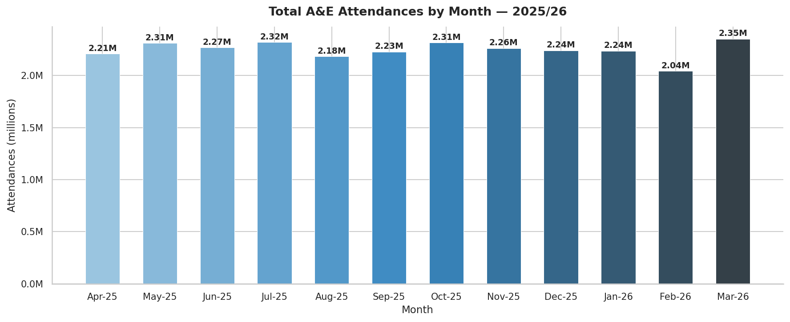](figures/analysis1_monthly_attendances.png)

### Analysis 2 — 4-Hour Breach Rate
[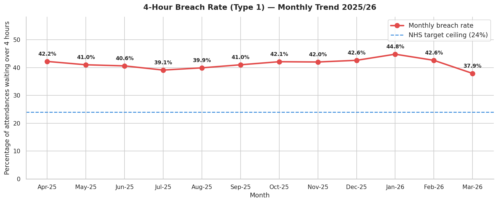](figures/analysis2_4hr_breach_rate.png)

### Analysis 3 — 12 Hour or Longer Waits
[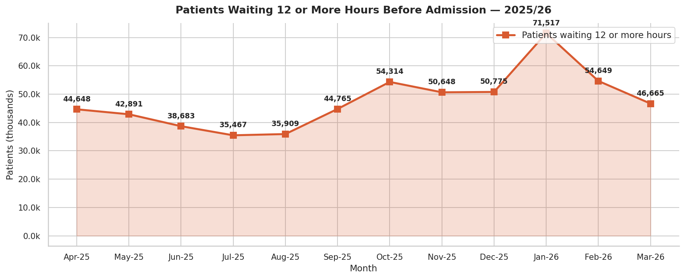](figures/analysis3_long_waits.png)

### Analysis 4 — Top 10 Providers by Attendance
[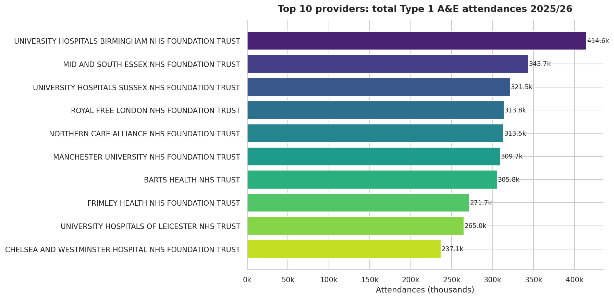](figures/analysis4_top10_providers.png)

### Analysis 5 — Worst 10 Providers by Breach Rate
[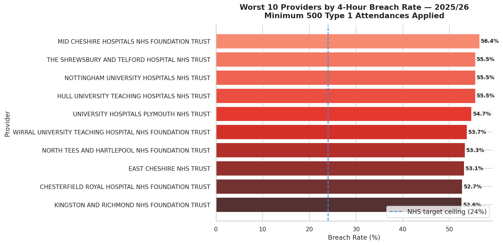](figures/analysis5_worst10_breach.png)

### Analysis 6 — Emergency Admissions
[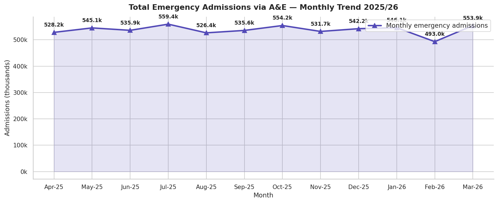](figures/analysis6_emergency_admissions.png)

### Analysis 7 — Regional Attendance Breakdown
[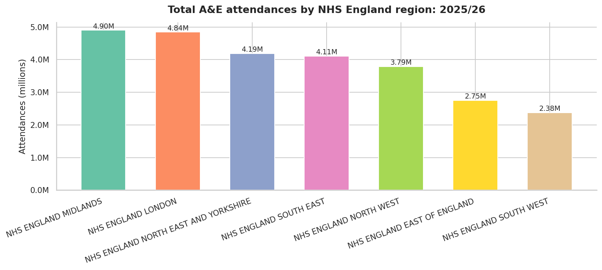](figures/analysis7_regional_breakdown.png)

### Analysis 8 — Winter Pressure
[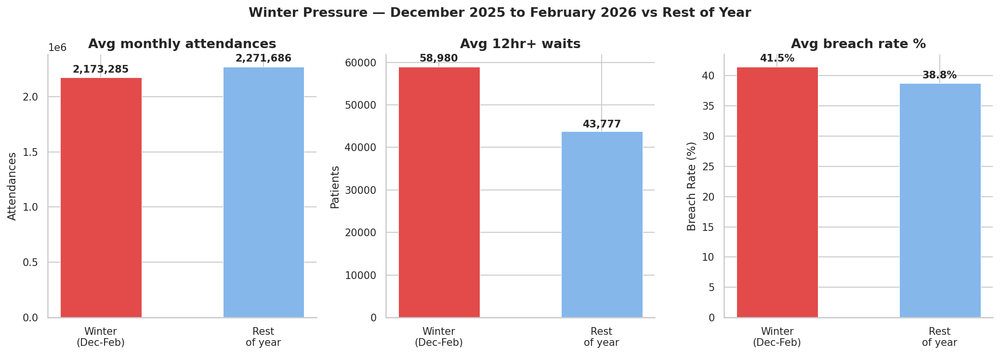](figures/analysis8_winter_pressure.png)

### Analysis 10 — Month on Month Change
[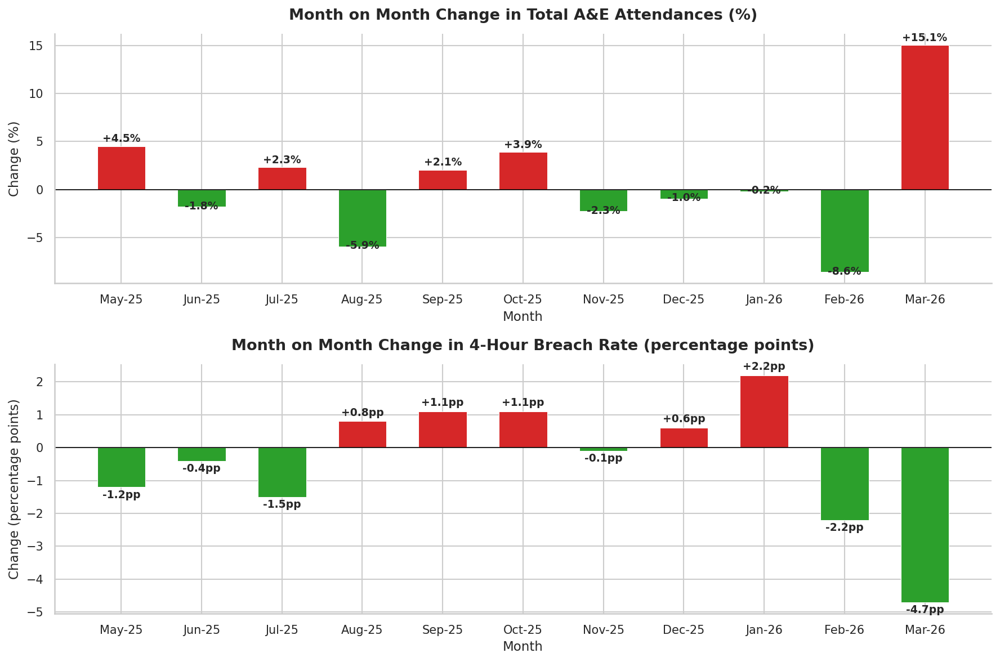](figures/analysis10_month_on_month_change.png)

### Analysis 11 — Best 10 Providers by Breach Rate
[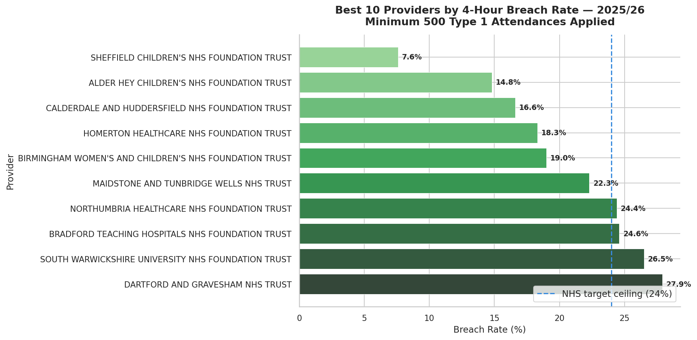](figures/analysis11_best10_providers.png)

### Analysis 12 — Regional Breach Rate Comparison
[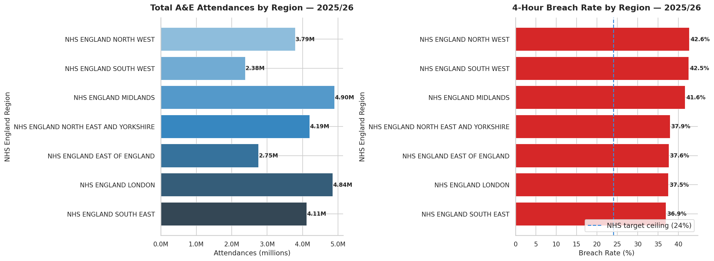](figures/analysis12_regional_breach.png)

### Analysis 13 — Regional Performance Variation
[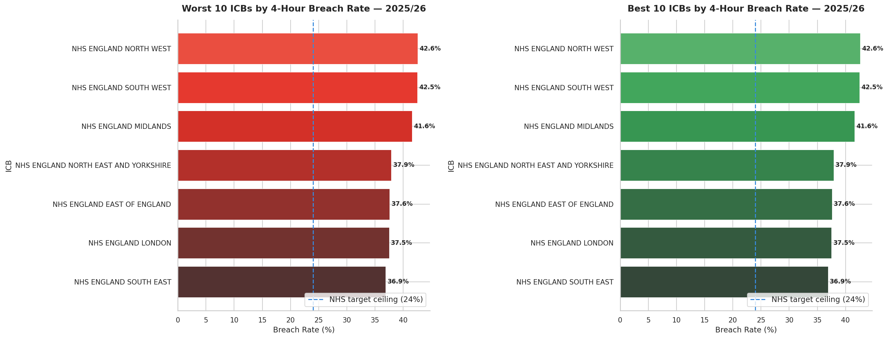](figures/analysis13_icb_performance.png)

### Analysis 14 — Provider Performance Consistency
[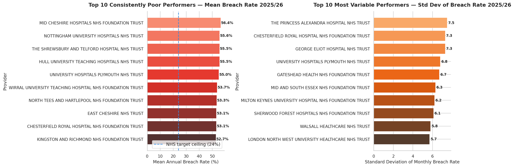](figures/analysis14_provider_consistency.png)

### Analysis 15 — Summary Heatmap
[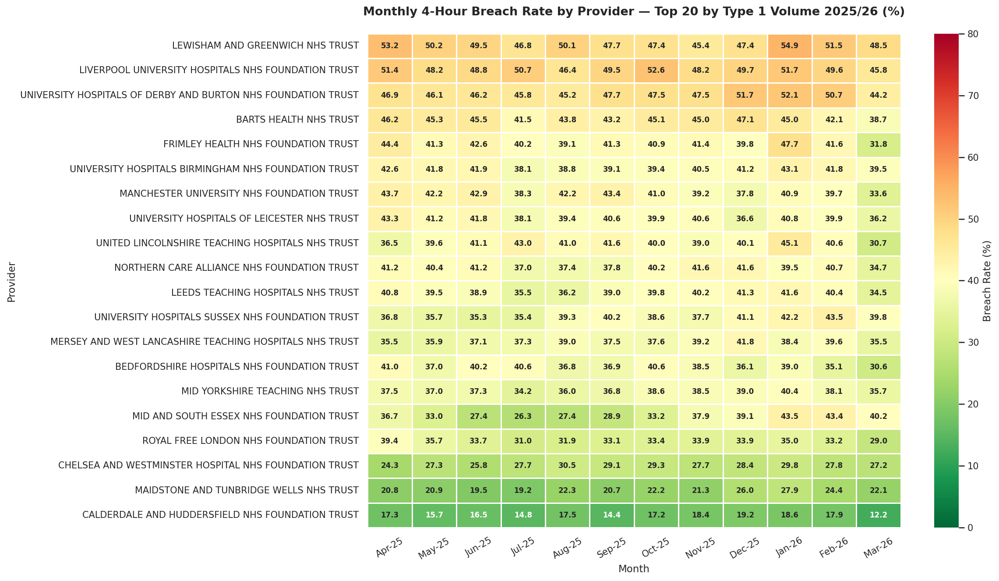](figures/analysis15_summary_heatmap.png)

### Power BI Dashboard — Page 1 — National Performance Overview
[](dashboard/national_performance_overview.png)

### Power BI Dashboard — Page 2 — Provider and Regional Analysis
[](dashboard/provider_regional_analysis.png)

---

## Author
**Kingsley Eboh**
[GitHub](https://github.com/Kingsley-Eboh)

*Data sourced from NHS England. This project is intended for portfolio
and educational purposes.*
